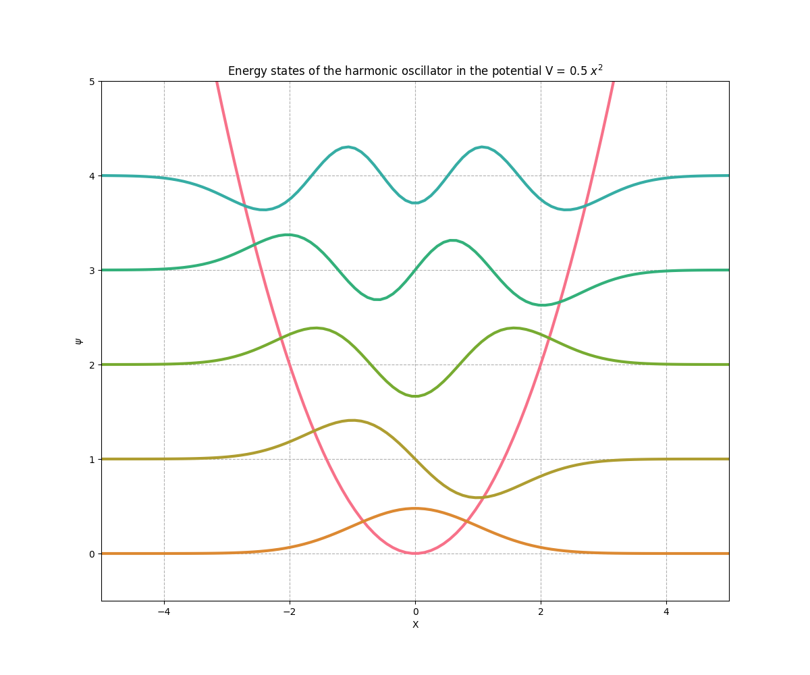

# Quantum potentials 

Calculates quantum energy states in a potential for: 
  - The standard exponential potential $V = \frac{1}{2} x^2 $
  - The Gaussian potential $V = - V_0 e^{-|x|}$

Energy states are plotted in a stacked manner for visualisation, as shown below.

